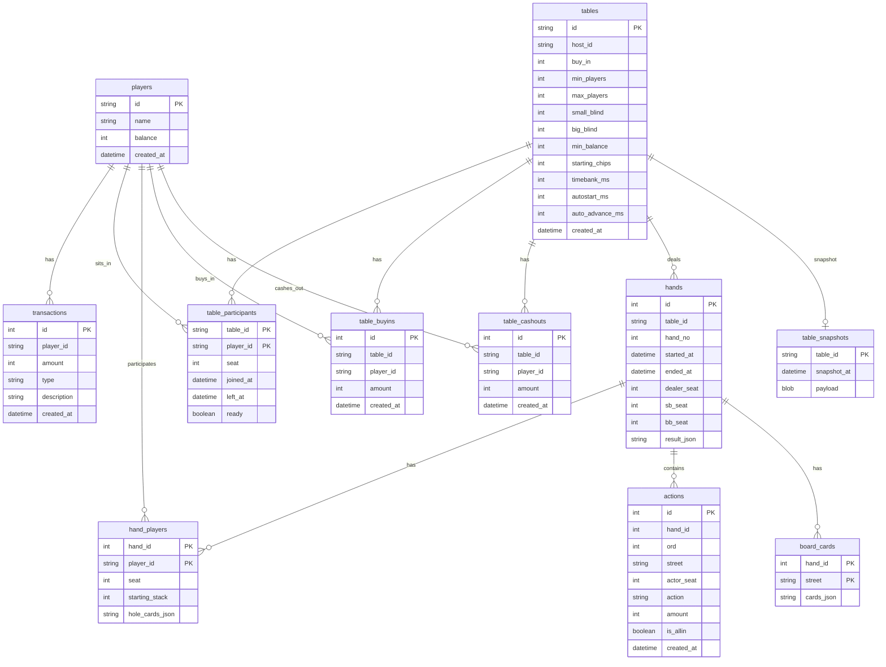
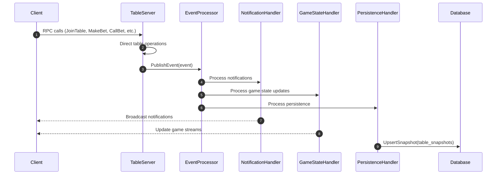
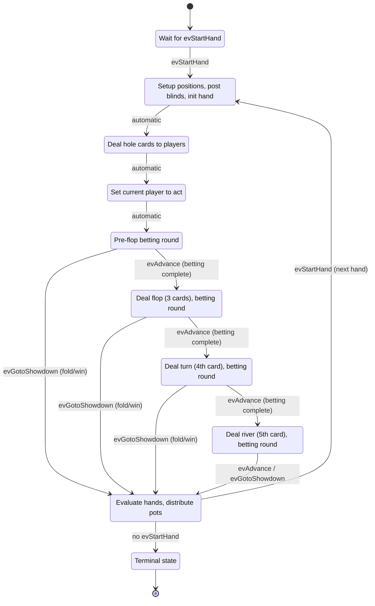
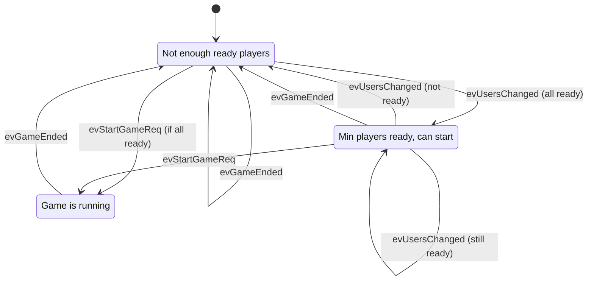
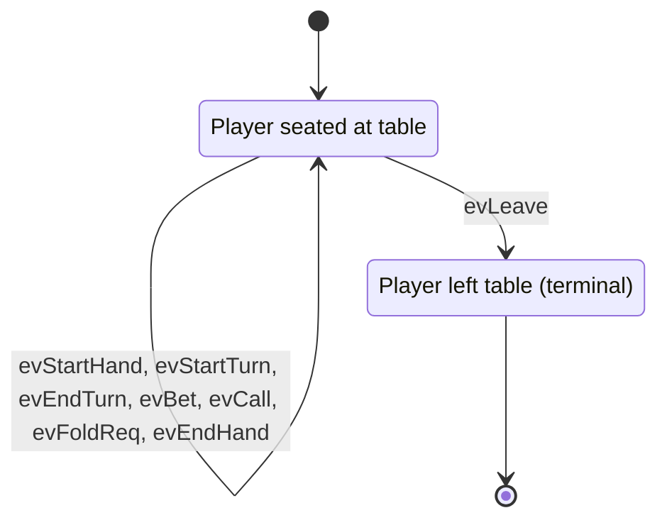
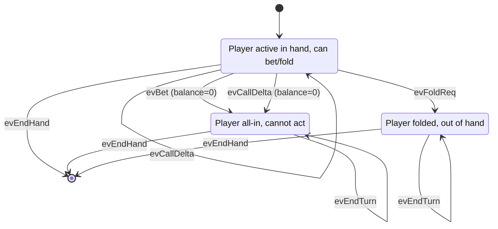

## DB


## Events

The system uses an event-driven architecture with snapshot-based persistence.

### Event Processing Flow



### Event Types

Events are `NotificationType` enum values from the protobuf definition:
- `TABLE_CREATED`, `TABLE_REMOVED`
- `PLAYER_JOINED`, `PLAYER_LEFT`, `PLAYER_READY`
- `GAME_STARTED`, `GAME_ENDED`, `NEW_HAND_STARTED`
- `BET_MADE`, `CALL_MADE`, `CHECK_MADE`, `PLAYER_FOLDED`
- `SHOWDOWN_RESULT`, `PLAYER_ALL_IN`

### Event Processing Architecture

1. **EventProcessor**: Manages a queue of events with worker goroutines
2. **NotificationHandler**: Broadcasts events to connected clients
3. **GameStateHandler**: Updates game state streams for real-time UI
4. **PersistenceHandler**: Saves table snapshots for fast restoration

## State Machine

### Game


### Game State Responsibilities

- **NEW_HAND_DEALING**: Initial state, waits for `evStartHand` to begin hand
- **PRE_DEAL**: Advances dealer button, calculates blind positions, posts blinds, initializes `currentHand`, starts player hand participation FSMs
- **DEAL**: Deals hole cards from the deck to all active players
- **BLINDS**: Determines first player to act based on blind positions
- **PRE_FLOP**: First betting round with hole cards only
- **FLOP**: Deals 3 community cards, second betting round
- **TURN**: Deals 4th community card, third betting round  
- **RIVER**: Deals 5th community card, final betting round
- **SHOWDOWN**: Hand evaluation, pot distribution, winner determination
- **END**: Terminal state (game stopped)

## Table State Machine

The table tracks lobby readiness and coordinates game lifecycle.



### Table State Responsibilities

- **WAITING_FOR_PLAYERS**: Initial state. Waits for enough players to be seated and ready. Responds to player join/ready events (`evUsersChanged`).
- **PLAYERS_READY**: All conditions met to start a game. Server can call `StartGame()` which sends `evStartGameReq` to transition to GAME_ACTIVE.
- **GAME_ACTIVE**: Game is running (hands are being played). Remains active across multiple hands. Returns to WAITING_FOR_PLAYERS on `evGameEnded`.

## Player State Machines

Each player has **two independent state machines** that run concurrently:

### 1. Table Presence FSM
Tracks whether the player is seated at the table. Lives for the entire session.



### 2. Hand Participation FSM
Tracks player actions during a single hand. Created when hand starts, destroyed when hand ends.



### Player State Machine Responsibilities

**Table Presence FSM:**
- **SEATED**: Handles readiness, blind deductions (game-commanded), chip additions (winnings/refunds), and disconnect events. Forwards hand-related events to Hand Participation FSM if active.
- **LEFT**: Terminal state when player leaves table.

**Hand Participation FSM:**
- **ACTIVE**: Player can make betting decisions (bet, call, fold). Sets `isTurn` flag when it's player's turn. Auto-transitions to ALL_IN when balance reaches zero.
- **ALL_IN**: Player has committed all chips, cannot make further actions. Passively waits for hand completion.
- **FOLDED**: Player has folded, out of the hand. Sets `hasFolded` flag and waits for hand completion.

## State Machine Coordination

The three layers of state machines coordinate to manage the complete poker game lifecycle:

```
Table FSM (Lobby/Session)
    │
    ├─ Manages: Player readiness, game lifecycle
    │
    └─► Game FSM (Hand Progression)
         │
         ├─ Manages: Dealer rotation, blinds, betting rounds, deck
         │
         └─► Player FSMs (Individual Actions)
              │
              ├─ Table Presence: Seated/Left (session-level)
              └─ Hand Participation: Active/AllIn/Folded (hand-level)
```
