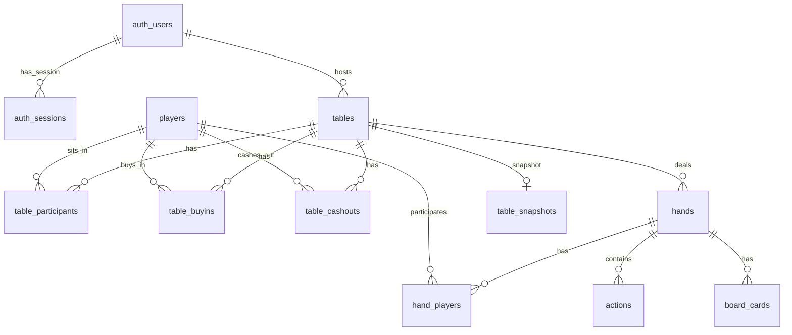

## DB schema (SQLite)
Authoritative tables come from `pkg/server/internal/db/migrations/0001_init.sql`.

### Tables

- **auth_users**
  - `user_id` TEXT PK
  - `nickname` TEXT NOT NULL
  - `payout_address` TEXT
  - `created_at` TIMESTAMP DEFAULT CURRENT_TIMESTAMP
  - `last_login` TIMESTAMP

- **auth_sessions**
  - `token` TEXT PK
  - `user_id` TEXT NOT NULL (FK → `auth_users.user_id` ON DELETE CASCADE)
  - `nickname` TEXT NOT NULL
  - `created_at` TIMESTAMP DEFAULT CURRENT_TIMESTAMP
  - `expires_at` TIMESTAMP

- **players**
  - `id` TEXT PK
  - `name` TEXT NOT NULL
  - `created_at` TIMESTAMP DEFAULT CURRENT_TIMESTAMP

- **tables**
  - `id` TEXT PK
  - `host_id` TEXT NOT NULL (FK → `auth_users.user_id`)
  - `buy_in`, `min_players`, `max_players`, `small_blind`, `big_blind`, `starting_chips` INTEGER NOT NULL
  - `timebank_ms` INTEGER NOT NULL DEFAULT 0
  - `autostart_ms` INTEGER NOT NULL DEFAULT 0
  - `auto_advance_ms` INTEGER NOT NULL DEFAULT 1000
  - `created_at` TIMESTAMP DEFAULT CURRENT_TIMESTAMP

- **table_participants**
  - `table_id` TEXT NOT NULL (FK → `tables.id` ON DELETE CASCADE)
  - `player_id` TEXT NOT NULL (FK → `players.id`)
  - `seat` INTEGER NOT NULL
  - `joined_at` TIMESTAMP DEFAULT CURRENT_TIMESTAMP
  - `left_at` TIMESTAMP NULL
  - `ready` BOOLEAN NOT NULL DEFAULT FALSE
  - PK (`table_id`, `player_id`)

- **table_buyins**
  - `id` INTEGER PK AUTOINCREMENT
  - `table_id` TEXT NOT NULL (FK → `tables.id` ON DELETE CASCADE)
  - `player_id` TEXT NOT NULL (FK → `players.id`)
  - `amount` INTEGER NOT NULL
  - `created_at` TIMESTAMP DEFAULT CURRENT_TIMESTAMP

- **table_cashouts**
  - `id` INTEGER PK AUTOINCREMENT
  - `table_id` TEXT NOT NULL (FK → `tables.id` ON DELETE CASCADE)
  - `player_id` TEXT NOT NULL (FK → `players.id`)
  - `amount` INTEGER NOT NULL
  - `created_at` TIMESTAMP DEFAULT CURRENT_TIMESTAMP

- **hands**
  - `id` INTEGER PK AUTOINCREMENT
  - `table_id` TEXT NOT NULL (FK → `tables.id` ON DELETE CASCADE)
  - `hand_no` INTEGER NOT NULL (UNIQUE per table)
  - `started_at` TIMESTAMP DEFAULT CURRENT_TIMESTAMP
  - `ended_at` TIMESTAMP
  - `dealer_seat`, `sb_seat`, `bb_seat` INTEGER NOT NULL
  - `result_json` TEXT

- **hand_players**
  - `hand_id` INTEGER NOT NULL (FK → `hands.id` ON DELETE CASCADE)
  - `player_id` TEXT NOT NULL (FK → `players.id`)
  - `seat` INTEGER NOT NULL
  - `starting_stack` INTEGER NOT NULL
  - `hole_cards_json` TEXT
  - PK (`hand_id`, `player_id`)

- **actions**
  - `id` INTEGER PK AUTOINCREMENT
  - `hand_id` INTEGER NOT NULL (FK → `hands.id` ON DELETE CASCADE)
  - `ord` INTEGER NOT NULL (unique per hand)
  - `street` TEXT NOT NULL
  - `actor_seat` INTEGER NOT NULL
  - `action` TEXT NOT NULL
  - `amount` INTEGER NOT NULL DEFAULT 0
  - `is_allin` BOOLEAN NOT NULL DEFAULT FALSE
  - `created_at` TIMESTAMP DEFAULT CURRENT_TIMESTAMP

- **board_cards**
  - `hand_id` INTEGER NOT NULL (FK → `hands.id` ON DELETE CASCADE)
  - `street` TEXT NOT NULL
  - `cards_json` TEXT NOT NULL
  - PK (`hand_id`, `street`)

- **table_snapshots** (non-canonical cache for fast restore)
  - `table_id` TEXT PK (FK → `tables.id` ON DELETE CASCADE)
  - `snapshot_at` TIMESTAMP NOT NULL DEFAULT CURRENT_TIMESTAMP
  - `payload` BLOB NOT NULL

- **schema_migrations** (migration tracking)
  - `version` INTEGER PK
  - `name` TEXT NOT NULL
  - `applied_at` TIMESTAMP NOT NULL DEFAULT CURRENT_TIMESTAMP
