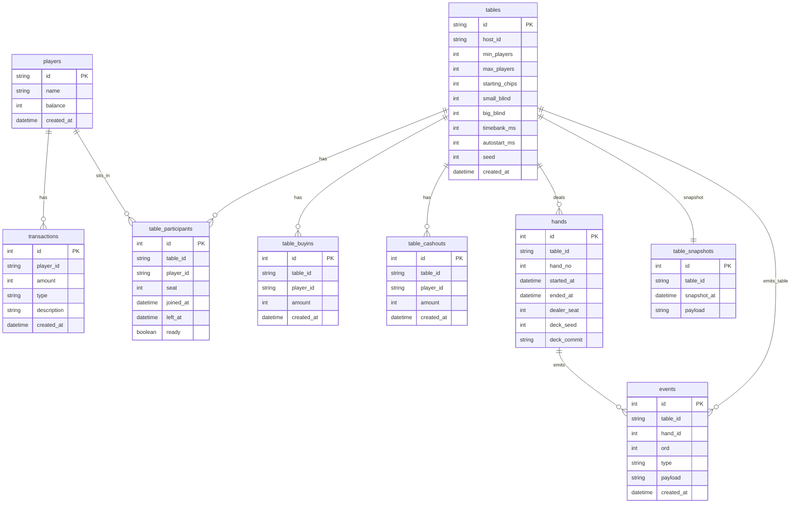
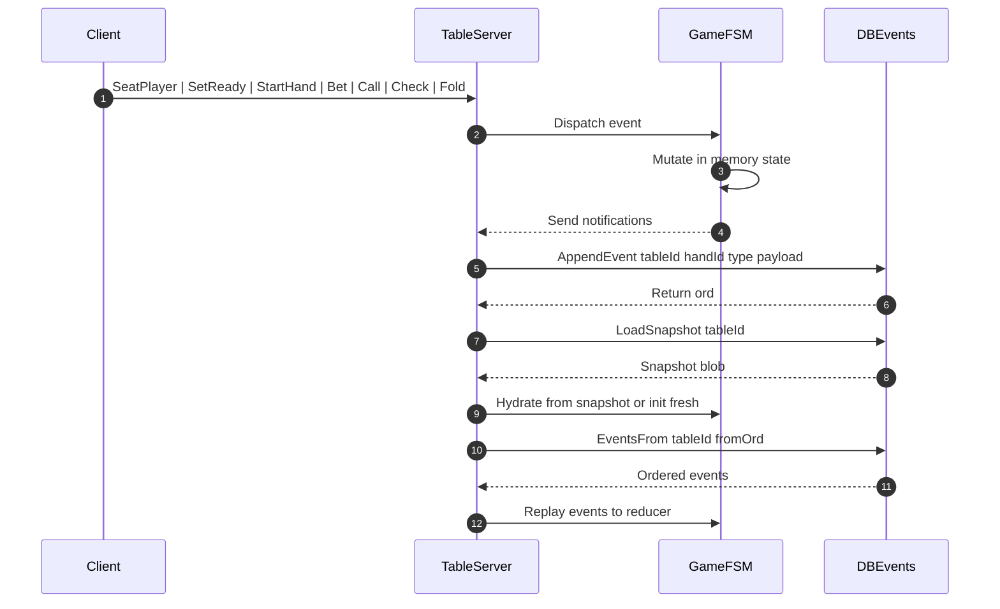
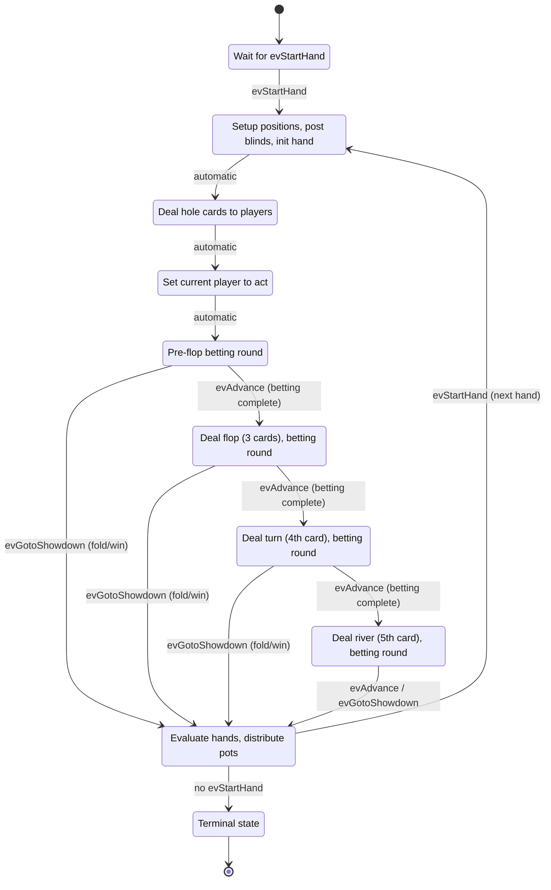
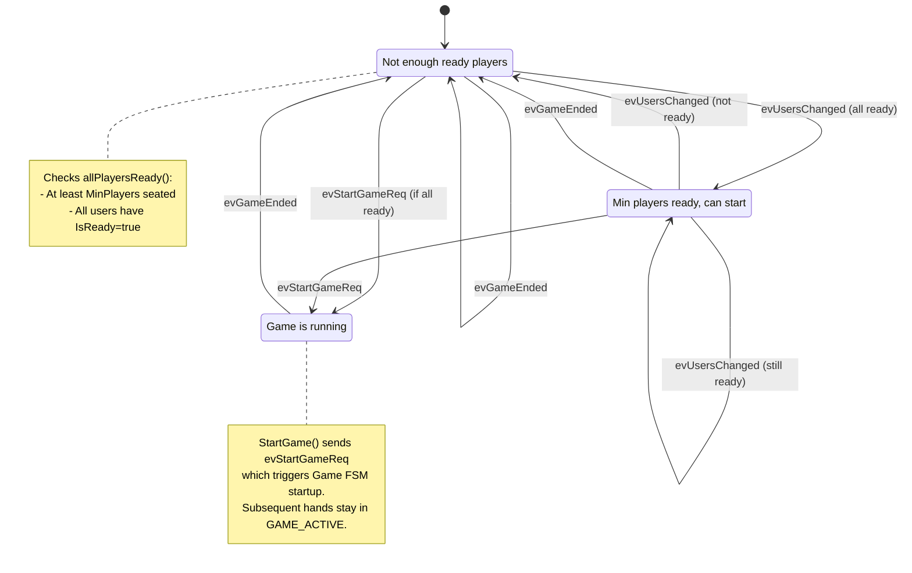
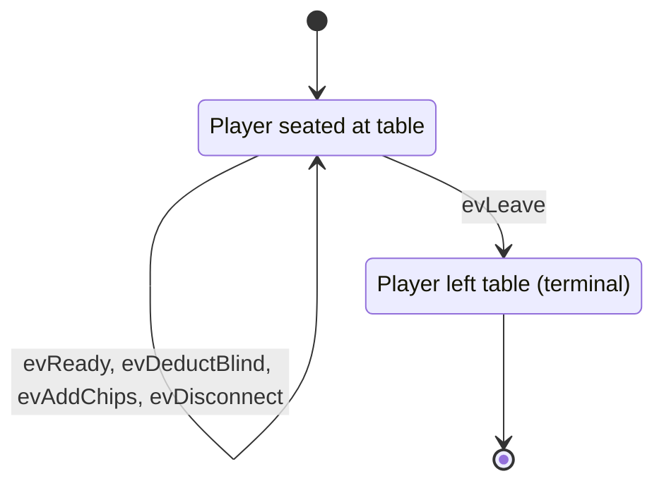
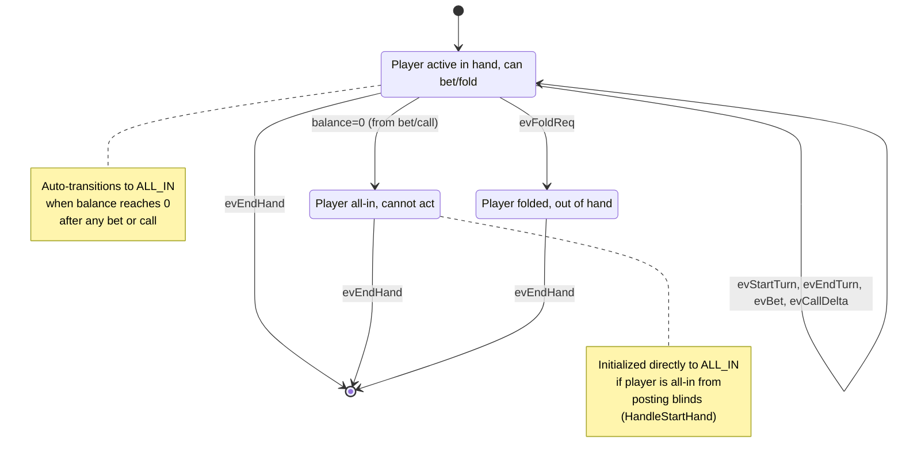

## DB


## Events



## State Machine


### Game State Responsibilities

- **NEW_HAND_DEALING**: Initial state, waits for `evStartHand` to begin hand
- **PRE_DEAL**: Advances dealer button, calculates blind positions, posts blinds, initializes `currentHand`, starts player hand participation FSMs
- **DEAL**: Deals hole cards from the deck to all active players
- **BLINDS**: Determines first player to act based on blind positions
- **PRE_FLOP**: First betting round with hole cards only
- **FLOP**: Deals 3 community cards, second betting round
- **TURN**: Deals 4th community card, third betting round  
- **RIVER**: Deals 5th community card, final betting round
- **SHOWDOWN**: Hand evaluation, pot distribution, winner determination
- **END**: Terminal state (game stopped)

## Table State Machine

The table tracks lobby readiness and coordinates game lifecycle.



### Table State Responsibilities

- **WAITING_FOR_PLAYERS**: Initial state. Waits for enough players to be seated and ready. Responds to player join/ready events (`evUsersChanged`).
- **PLAYERS_READY**: All conditions met to start a game. Server can call `StartGame()` which sends `evStartGameReq` to transition to GAME_ACTIVE.
- **GAME_ACTIVE**: Game is running (hands are being played). Remains active across multiple hands. Returns to WAITING_FOR_PLAYERS on `evGameEnded`.

## Player State Machines

Each player has **two independent state machines** that run concurrently:

### 1. Table Presence FSM
Tracks whether the player is seated at the table. Lives for the entire session.



### 2. Hand Participation FSM
Tracks player actions during a single hand. Created when hand starts, destroyed when hand ends.



### Player State Machine Responsibilities

**Table Presence FSM:**
- **SEATED**: Handles readiness, blind deductions (game-commanded), chip additions (winnings/refunds), and disconnect events. Forwards hand-related events to Hand Participation FSM if active.
- **LEFT**: Terminal state when player leaves table.

**Hand Participation FSM:**
- **ACTIVE**: Player can make betting decisions (bet, call, fold). Sets `isTurn` flag when it's player's turn. Auto-transitions to ALL_IN when balance reaches zero.
- **ALL_IN**: Player has committed all chips, cannot make further actions. Passively waits for hand completion.
- **FOLDED**: Player has folded, out of the hand. Sets `hasFolded` flag and waits for hand completion.

### Key Design Notes

1. **Separation of Concerns**: Table presence persists across hands; hand participation is created/destroyed per hand.
2. **Flag-Based State**: FSMs set durable flags (`hasFolded`, `isAllIn`) that persist after FSM stops, ensuring showdown logic sees correct state.
3. **Event Forwarding**: Table presence FSM forwards unknown events to hand participation FSM when active.
4. **Synchronous Initialization**: Game's `statePreDeal` posts blinds first, then calls `HandleStartHand()` which detects all-in condition and initializes FSM in correct state (ACTIVE or ALL_IN).
5. **Event Naming Convention**: Events like `evDeductBlind` and `evAddChips` use action-oriented names to clarify they are game-commanded state updates (not player actions). This follows the command pattern where Game commands Player FSM to update state, maintaining encapsulation and thread safety.

## State Machine Coordination

The three layers of state machines coordinate to manage the complete poker game lifecycle:

```
Table FSM (Lobby/Session)
    │
    ├─ Manages: Player readiness, game lifecycle
    │
    └─► Game FSM (Hand Progression)
         │
         ├─ Manages: Dealer rotation, blinds, betting rounds, deck
         │
         └─► Player FSMs (Individual Actions)
              │
              ├─ Table Presence: Seated/Left (session-level)
              └─ Hand Participation: Active/AllIn/Folded (hand-level)
```

### Typical Flow

1. **Table: WAITING_FOR_PLAYERS**
   - Players join, mark ready
   - `evUsersChanged` → checks `allPlayersReady()`
   - Transitions to `PLAYERS_READY`

2. **Table: PLAYERS_READY → GAME_ACTIVE**
   - Server calls `StartGame()`
   - Table sends `evStartGameReq` to Table FSM
   - Table creates Game instance and starts Game FSM
   - Game FSM receives `evStartHand` → `statePreDeal`

3. **Game: statePreDeal → stateDeal → stateBlinds → statePreFlop**
   - `statePreDeal`: Advances dealer, posts blinds, creates Hand Participation FSMs
   - `stateDeal`: Deals hole cards
   - `stateBlinds`: Sets first player to act
   - `statePreFlop`: Begins first betting round

4. **Game: Betting Rounds (PRE_FLOP → FLOP → TURN → RIVER)**
   - Game sets `currentPlayer`, sends `evStartTurn`
   - Player Hand Participation FSM handles betting actions
   - Player FSM sends action responses back to Game
   - Game validates, updates pot, advances to next player
   - On round complete: Game sends `evAdvance` → next street

5. **Game: SHOWDOWN**
   - Game evaluates hands, distributes pots
   - Game sends `GameEventShowdownComplete` to Table
   - Table stores result, publishes to clients
   - Auto-start timer triggers `startNewHand()`

6. **Subsequent Hands**
   - Table stays in `GAME_ACTIVE`
   - `startNewHand()` calls `Game.ResetForNewHandFromUsers()`
   - Game resets deck, clears `currentHand`
   - Game receives `evStartHand` → loops back to `statePreDeal`
   - Player Hand Participation FSMs destroyed and recreated each hand

7. **Game Ends**
   - Game sends `evGameEnded` to Table FSM
   - Table transitions `GAME_ACTIVE` → `WAITING_FOR_PLAYERS`
   - Player Table Presence FSMs remain active (players still seated)
   - Player Hand Participation FSMs destroyed

### Critical Synchronization Points

1. **Blind Posting Before Hand Start**: `statePreDeal` posts blinds BEFORE calling `HandleStartHand()`, ensuring players see correct balances and can detect all-in from blinds.

2. **PRE_FLOP Wait**: `StartGame()` and `startNewHand()` wait for Game FSM to reach `statePreFlop` before broadcasting `NEW_HAND_STARTED`, ensuring clients see complete state (blinds posted, current player set).

3. **Event Forwarding**: Player Table Presence FSM forwards unhandled events to Hand Participation FSM, allowing betting actions to reach the correct handler.

4. **Flag Persistence**: Player FSMs set flags (`hasFolded`, `isAllIn`) that outlive the FSM lifecycle, ensuring showdown sees correct state after FSM stops.
