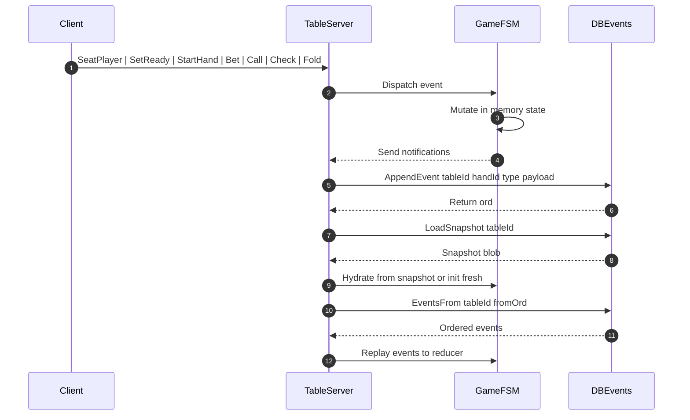
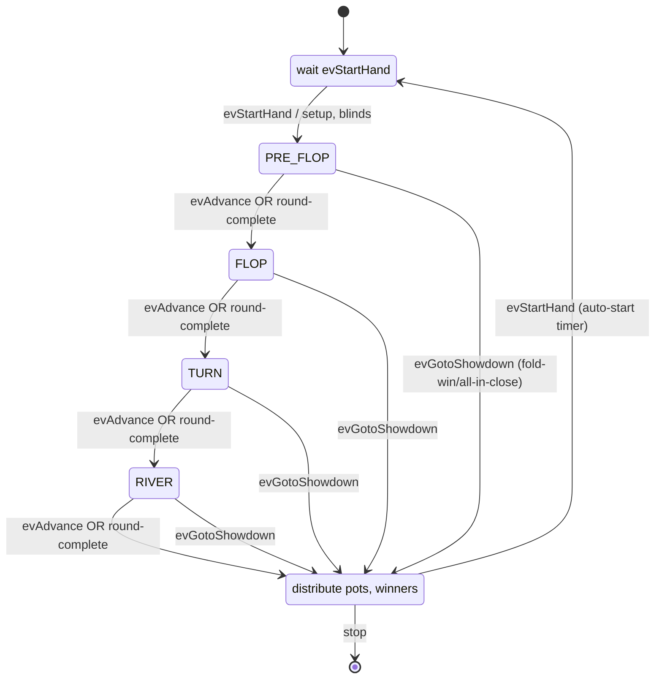

## DB

```mermaid
erDiagram
  players ||--o{ transactions : has
  players ||--o{ table_participants : sits_in
  tables  ||--o{ table_participants : has
  tables  ||--o{ table_buyins : has
  tables  ||--o{ table_cashouts : has
  tables  ||--o{ hands : deals
  hands   ||--o{ events : emits
  tables  ||--o{ events : emits_table
  tables  ||--|| table_snapshots : snapshot

  players {
    string   id PK
    string   name
    int      balance
    datetime created_at
  }

  transactions {
    int      id PK
    string   player_id
    int      amount
    string   type
    string   description
    datetime created_at
  }

  tables {
    string   id PK
    string   host_id
    int      min_players
    int      max_players
    int      starting_chips
    int      small_blind
    int      big_blind
    int      timebank_ms
    int      autostart_ms
    int      seed
    datetime created_at
  }

  table_participants {
    int      id PK
    string   table_id
    string   player_id
    int      seat
    datetime joined_at
    datetime left_at
    boolean  ready
  }

  table_buyins {
    int      id PK
    string   table_id
    string   player_id
    int      amount
    datetime created_at
  }

  table_cashouts {
    int      id PK
    string   table_id
    string   player_id
    int      amount
    datetime created_at
  }

  hands {
    int      id PK
    string   table_id
    int      hand_no
    datetime started_at
    datetime ended_at
    int      dealer_seat
    int      deck_seed
    string   deck_commit
  }

  events {
    int      id PK
    string   table_id
    int      hand_id
    int      ord
    string   type
    string   payload
    datetime created_at
  }

  table_snapshots {
    int      id PK
    string   table_id
    datetime snapshot_at
    string   payload
  }

```

## Events

```mermaid
sequenceDiagram
  autonumber
  participant C as Client
  participant T as TableServer
  participant G as GameFSM
  participant DB as DBEvents

  C->>T: SeatPlayer | SetReady | StartHand | Bet | Call | Check | Fold
  T->>G: Dispatch event
  G->>G: Mutate in memory state
  G-->>T: Send notifications
  T->>DB: AppendEvent tableId handId type payload
  DB-->>T: Return ord

  T->>DB: LoadSnapshot tableId
  DB-->>T: Snapshot blob
  T->>G: Hydrate from snapshot or init fresh
  T->>DB: EventsFrom tableId fromOrd
  DB-->>T: Ordered events
  T->>G: Replay events to reducer


```

## State Machine

```mermaid
%% Game FSM — high-level phases (Rob Pike style)
stateDiagram-v2
  [*] --> NEW_HAND_DEALING

  NEW_HAND_DEALING: wait evStartHand
  NEW_HAND_DEALING --> PRE_FLOP: evStartHand / setup, blinds
  PRE_FLOP --> FLOP: evAdvance OR round-complete
  FLOP --> TURN: evAdvance OR round-complete
  TURN --> RIVER: evAdvance OR round-complete
  RIVER --> SHOWDOWN: evAdvance OR round-complete

  PRE_FLOP --> SHOWDOWN: evGotoShowdown (fold-win/all-in-close)
  FLOP --> SHOWDOWN: evGotoShowdown
  TURN --> SHOWDOWN: evGotoShowdown
  RIVER --> SHOWDOWN: evGotoShowdown

  SHOWDOWN: distribute pots, winners
  SHOWDOWN --> NEW_HAND_DEALING: evStartHand (auto-start timer)
  SHOWDOWN --> [*]: stop
```
