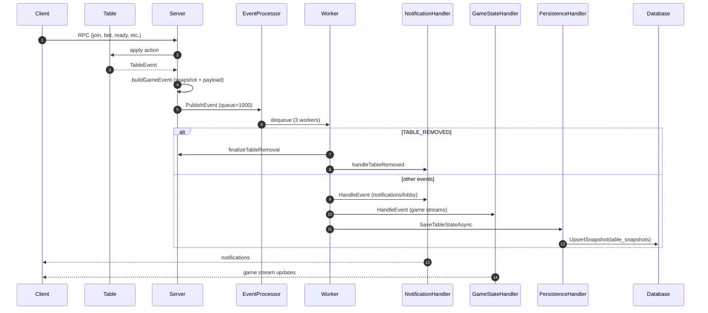

## Events

The server fan-outs every poker table change through an event pipeline that
drives notifications, live game streams, and persistence snapshots.

### Sources
- Poker tables emit `poker.TableEvent`. `processTableEvents` converts that into a
  `GameEvent` via `buildGameEvent`, collecting a `TableSnapshot` and coercing
  payloads into server-friendly structs.
- Server lifecycle events publish `TABLE_CREATED`/`TABLE_REMOVED` directly.
  Table removal goes through `publishTableRemovedEvent` and uses an ack channel
  so tests and callers can wait for cleanup.

### Processing Flow

### Event Types

Handled `NotificationType` values:
- `TABLE_CREATED`, `TABLE_REMOVED`
- `PLAYER_JOINED`, `PLAYER_LEFT`, `PLAYER_READY`, `PLAYER_LOST`
- `GAME_STARTED`, `GAME_ENDED`, `NEW_HAND_STARTED`
- `BET_MADE`, `CALL_MADE`, `CHECK_MADE`, `PLAYER_FOLDED`, `PLAYER_ALL_IN`
- `SHOWDOWN_RESULT`

### Handler Behavior
- **EventProcessor**: bounded queue (1000) with 3 workers. Drops events if the
  processor is stopped or the queue is full, incrementing `event_drop` metrics.
- **NotificationHandler**: broadcasts per-table notifications and lobby updates.
  `GAME_ENDED` triggers settlement attempts and schedules table removal.
- **GameStateHandler**: builds per-player `GameUpdate` messages from the event’s
  snapshot; skips `GAME_ENDED` to avoid redundant winner queries.
- **PersistenceHandler**: calls `saveTableStateAsync` (per-table mutex) to
  upsert JSON snapshots; skipped for `TABLE_REMOVED` which is finalized
  synchronously before notifying clients.
