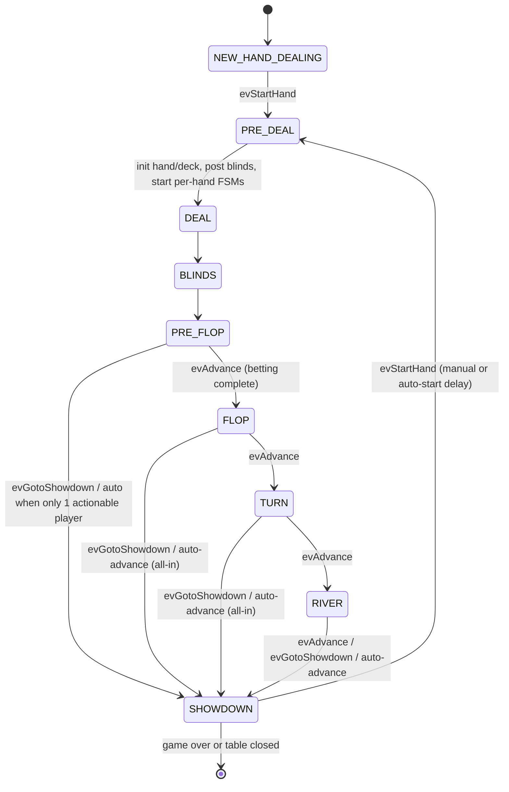
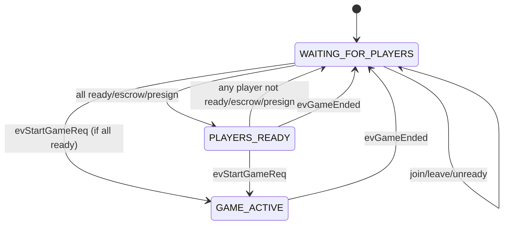
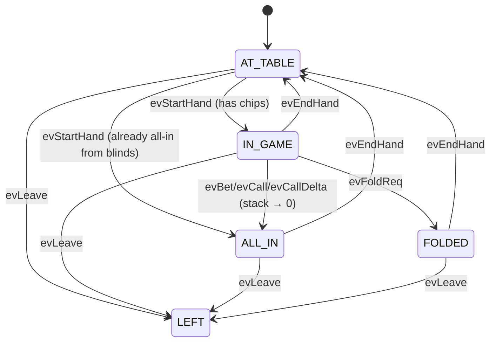
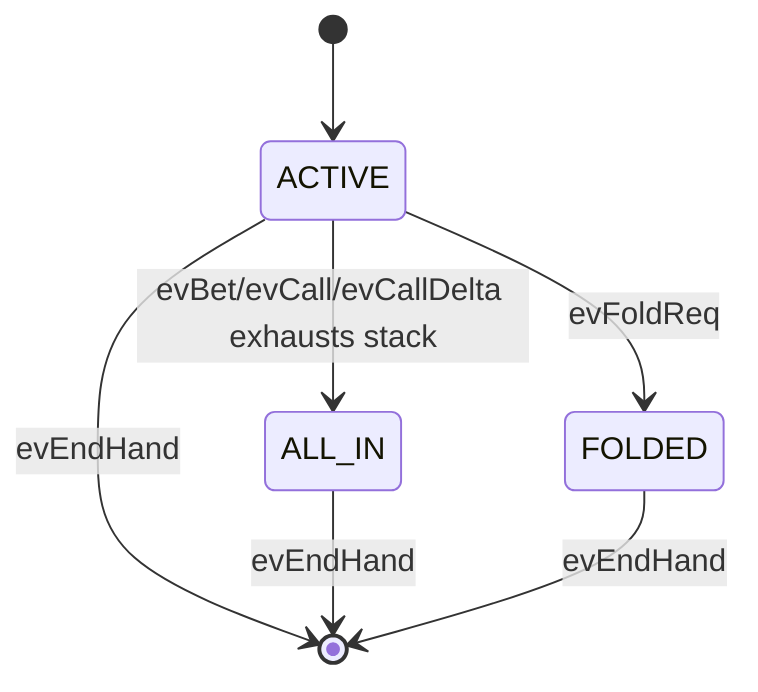

## State Machine

### Game (hand progression)

**Responsibilities & behaviors**
- **NEW_HAND_DEALING**: Idle between hands; waits for `evStartHand` (manual or auto-start after `AutoStartDelay`).
- **PRE_DEAL**: Resets round state, reseeds deck, rotates dealer, posts blinds **before** hand FSMs start, initializes `currentHand`, enables/clears auto-advance flags.
- **DEAL**: Deals hole cards.
- **BLINDS**: Picks first actor (skips all-in blind posters).
- **PRE_FLOP/FLOP/TURN/RIVER**: Betting streets; schedule auto-advance when everyone is all-in (`AutoAdvanceDelay`) and avoid starting turn timers when no action is possible.
- **SHOWDOWN**: Runs settlement, emits `GameEventShowdownComplete`, prunes busted players, fires `GameEventGameOver` when one stack remains, then waits for the next `evStartHand`.
- **RESTORED**: Special passive state for resumed games; routes `evAdvance` based on the persisted phase (used by `StartFromRestoredSnapshot`).
- **Timebank expiry**: `evTimebankExpired` auto-checks (no bet) or auto-folds (facing bet) and lets the round advance.

### Table (lobby/session)
Tracks readiness (including escrow/presign for buy-in tables) and owns the game lifecycle.

**Responsibilities**
- **WAITING_FOR_PLAYERS**: Default; reacts to ready/unready, escrow bound, presign resets, and `evUsersChanged`. Transitions when `CheckAllPlayersReady()` is true.
- **PLAYERS_READY**: All players ready (and escrow/presign satisfied for buy-in tables). `StartGame` emits `evStartGameReq` to enter `GAME_ACTIVE`.
- **GAME_ACTIVE**: Game running across multiple hands; on `evGameEnded` (from `GameEventGameOver`) returns to waiting.

### Player FSMs
Two independent machines per player: table presence and per-hand participation.

#### 1) Table Presence (session-level)

- Handles ready/unready, escrow binding, presign completion, disconnect/reconnect, blind deductions, and turn acks even when not yet in-hand.

#### 2) Hand Participation (per-hand)

- Starts fresh each hand (`HandleStartHand`), mirrors betting actions, and resets on `evEndHand`. Fold/all-in states still receive turn acks but cannot act.

### Coordination
- Table FSM gates game creation and wires `GameEvent` channel.
- Game FSM emits table-level events (betting round complete, showdown, player lost, game over) consumed by the server’s event pipeline.
- Player presence FSM runs for the session; per-hand FSM starts/stops every hand, enabling hand-specific flags while sharing the same player object.
